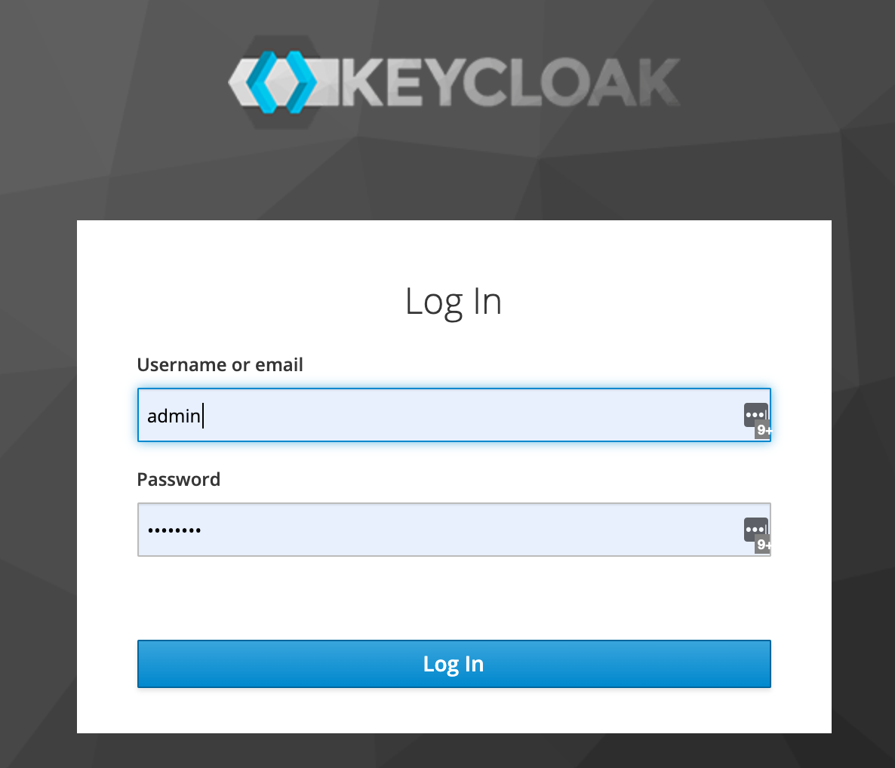
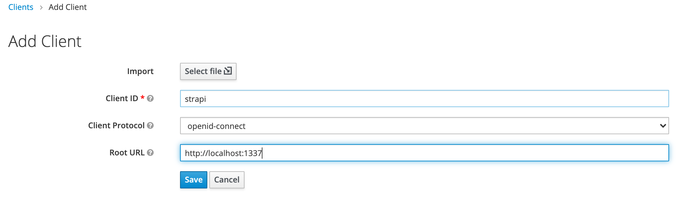
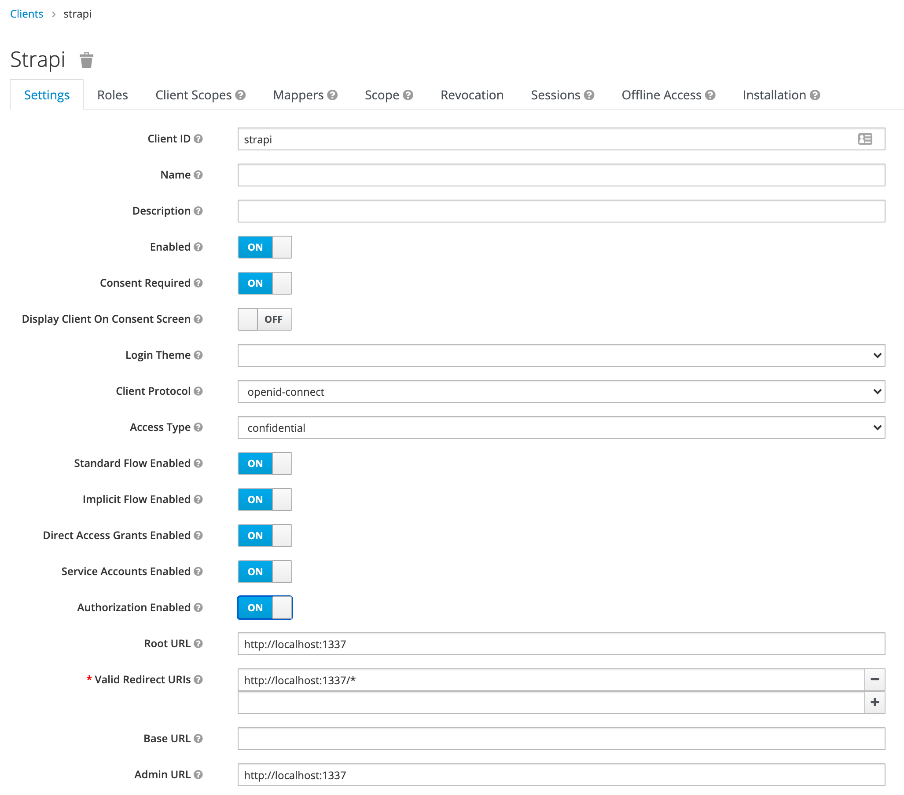
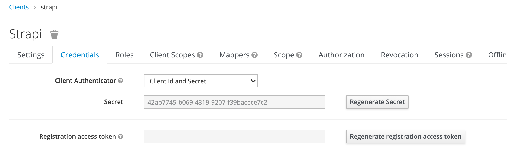

# strapi with keycloak extension
strapi with keycloak extension and distributed as a docker image.

Each strapi version has its own branch

| branch | url | 
| --     | -- |
| 3.1.4 | |

# build
```
$ docker-compose build
```

# usage 
start keycloak and configure client_id and client_secret 
## start keycloak
```
$ docker-compose up -d keycloak
```
Goto http://localhost:8080






## start strapi
```
$ docker-compose up -d strapi
```
